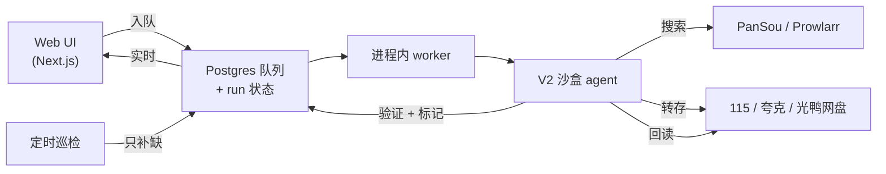

<p align="center">
  
</p>

<p align="center">
  <b>给你自己网盘用的 agent 驱动媒体库。</b>
</p>

<p align="center">
  <a href="https://github.com/fancydirty/mediary-scout/actions/workflows/ci.yml"></a>
  <a href="LICENSE"></a>
  
  
  
  
  <a href="https://github.com/fancydirty/mediary-scout/pulls"></a>
  <a href="https://mediary.dirtyfancy.sbs"></a>
</p>

<p align="center">
  <a href="#快速开始">快速开始</a> ·
  <a href="docs/deploy.md">部署指南</a> ·
  <a href="https://mediary.dirtyfancy.sbs">在线 Demo ↗</a> ·
  <a href="README.md">English</a>
</p>

你说要某部电影 / 剧 / 番,LLM agent 跨索引源搜罗资源、把最合适的转存进你自己的 115 / 夸克 / 光鸭网盘、转存后回读验证,并持续追踪还缺什么。


> *上图:只读 [在线 demo](https://mediary.dirtyfancy.sbs) —— 搜片 → 获取 → agent 走完搜索、转存、验证。*

> **免责声明。** Mediary Scout 是**开源、自部署**软件,**不提供、也永远不会提供托管服务** —— 你自己跑实例、自带网盘 / LLM / 元数据凭证。它做的就是你本可以在自己网盘里手动完成的那些文件操作。项目定位详见 [docs/distribution-and-legal-positioning.md](docs/distribution-and-legal-positioning.md)。

## 目录

- [它是什么](#它是什么)
- [功能](#功能)
- [架构](#架构)
- [快速开始](#快速开始)
- [部署](#部署)
- [Demo](#demo)
- [支持的网盘](#支持的网盘)
- [状态与限制](#状态与限制)
- [致谢与上游](#致谢与上游)

## 它是什么

大多数「媒体自动化」要么搜得好但不知道你到底缺哪集,要么会搬文件却从不验证落了什么。Mediary Scout 把获取当成一个**状态问题**,由一个「凭证据而非凭感觉」行动的 agent 驱动:

- **多盘、品牌可扩展** —— 现支持 115、夸克与光鸭云盘(GuangYaPan),每块盘都是一等工作区(树模型:一个账号、多块盘)。接入新网盘品牌是个收敛的插件活。
- **agent 选片** —— agent 读真实搜索结果,按画质偏好、**中文字幕**需求、去重来挑,转存后再回读验证。
- **追踪 + 定时补缺** —— 季级状态机;定时巡检只回来处理仍有缺集的剧。
- **网盘原生** —— 直接把分享 / 磁力**转存**(秒传 / save)进你的网盘,不往本地磁盘下载。

面向熟悉自己网盘账号与凭证的进阶自部署用户 —— 不是一键式消费产品。

## 功能

| | |
|---|---|
| **搜索 → 获取** —— 找到目标、点「获取」,agent 接管 |  |
| **媒体库墙** —— 按盘看你有什么,带缺集 / 追更徽章 |  |
| **剧详情** —— 各季覆盖、缺口、追踪状态 |  |
| **实时活动** —— 工作时的实时队列 + agent 动作 ticker |  |
| **通知** —— 单部获取 + 每日巡检摘要,多渠道推送 |  |
| **设置** —— 网盘、画质、语言、LLM(自带 key)、Prowlarr、PanSou |  |

多块盘以工作区切换器呈现,带各自品牌图标:


## 架构

web 端入队,常驻 worker 驱动一个沙盒 agent:agent 拥有窄而受审计的权限,所有副作用由确定性 workflow 拥有,并回读真实状态做验证。



- 状态全程落 **Postgres**,所以 run 可在 worker 重启后续跑(agent 从真实网盘 + DB 状态重建,不依赖缓存的对话历史)。
- 元数据来自 **TMDB**(内置代理兜底,开箱即用);资源搜索来自 **PanSou**,可选 **Prowlarr**(磁力 / 种子索引器)。

## 快速开始

最快是 Docker Compose(web + Postgres + 自带 PanSou):

```bash
cp .env.example .env   # 可选——大多数配置可在 UI 里填
docker compose up -d
```

> 🇨🇳 **国内连不上 Docker Hub?** 首次构建报 `auth.docker.io ... i/o timeout` / `DeadlineExceeded` = Docker Hub 被墙,**先配镜像加速**(Docker Desktop 与 Linux 方式不同):见 **[docs/deploy.md → 国内构建加速](docs/deploy.md#国内构建加速连不上-docker-hub)**。

打开 web UI,在**设置**里按需提供(全部自带):

- **网盘** —— 连 115 或夸克(扫码登录,或粘贴 cookie),或光鸭云盘(粘贴 `access_token` + `refresh_token`,见 [连接教程](docs/deploy.md#光鸭云盘guangyapan连接))。
- **TMDB** —— 经代理开箱即用;想直连可填自己的 key。
- **LLM** —— 任意 OpenAI 兼容端点(`baseURL` / `apiKey` / `modelId`)。作者看不到你的 key。
- **Prowlarr**(可选) —— 加你的索引器以获得磁力 / 种子源(115 与光鸭这类支持磁力的盘;夸克无磁力 API)。

## 部署

自部署到 NAS、软路由、闲置 PC 或 VPS,并经 **Tailscale** 或 **Cloudflare Tunnel** 从手机 / 电视访问(无需公网 IP;别把 `:3000` 裸暴露)。完整教程:**[docs/deploy.md](docs/deploy.md)**。

### 让 agent 帮你部署

想让 AI agent(Claude Code、Codex、opencode 等)带你走?把下面这段提示词丢给它——它会问对问题、然后替你部署:

````markdown
你要部署 Mediary Scout,一个自部署的媒体获取 agent。按仓库 docs/deploy.md 来。按下面顺序问用户,然后执行。

## 必问(没答案别开始)
1. **部署到哪台机器?** NAS / 软路由 / 闲置 PC / VPS,以及我怎么操作它——SSH 进去,还是在它本机终端跑命令?
2. **单账号还是多账号?** 默认单账号(就你自己用)。多账号让家人/朋友各注册、各绑自己的网盘、各看各的库。

## 建议问(有默认,但确认偏好)
3. **只在局域网用,还是出门也要用?**
   - 只在局域网(默认——同 WiFi 下设备开 `http://<主机IP>:3000`)
   - Tailscale(私有 mesh——家用推荐,无公网 IP、自动加密)
   - Cloudflare Tunnel(公网 HTTPS 如 `https://media.yourdomain.com`——需 Cloudflare 托管域名 + Access 前置鉴权)
4. **现在就配真实获取,还是先起来看看?** 真实获取需要 115/夸克网盘 + LLM 端点(OpenAI 兼容)+ (用 115 时)115 目录 CID。先不配也能起来看 UI,后续在设置页配。

## 可选——一句话问,都不需要就跳过用默认
5. 这些可选增强有想现在配的吗?都不需要就回"跳过":
   - 通知推送(Bark / Server酱 / 企微 / webhook)
   - 自己的 TMDB key(不配默认经作者代理开箱即用)
   - Prowlarr 磁力聚合(115 专属)
   - 国内构建加速(registry mirror + npm 镜像)

## 然后执行
- `git clone https://github.com/fancydirty/mediary-scout && cd mediary-scout`
- 国内构建加速(首次 `up` **之前**):`docker compose build --build-arg NPM_REGISTRY=https://registry.npmmirror.com` + `/etc/docker/daemon.json` 配 registry mirror
- `docker compose up -d`(首次构建几分钟)
- 多账号:在 `.env` 加 `MEDIA_TRACK_MULTI_USER=1`,再 `docker compose up -d web`
- Cloudflare Tunnel:按 docs/deploy.md §"方式二"——在 Zero Trust 控制台建隧道、把 token 写进 `.env` 的 `TUNNEL_TOKEN=<你的-token>`、`docker compose --profile tunnel up -d`,并**务必加 Cloudflare Access**(别裸挂公网)
- 打开 `http://<主机>:3000`,带用户走设置页(网盘 / LLM / 可选项)
- 确认起来、报 URL、告诉怎么升级(`git pull && docker compose up -d --build`)
````

## Demo

**🔭 在线体验:[mediary.dirtyfancy.sbs](https://mediary.dirtyfancy.sbs)**

公开的**只读** demo —— mock 网盘、真实 TMDB 全库搜索、点「获取」看一次脚本化获取落进媒体库。不连真盘、不转存、什么都不持久。由本仓库构建。

## 支持的网盘

三个国内网盘品牌,每块盘都是一等工作区:

- **115**(`pan115`) —— 完整支持,含经 Prowlarr 的磁力。
- **夸克**(`quark`) —— 分享链转存(无磁力 web API)。
- **光鸭云盘 / GuangYaPan**(`guangya`) —— 迅雷系网盘;**磁力 / 离线下载优先**(经离线任务 API 转存磁力 / ed2k / BT,与 115 的离线路径同理 —— v1 **不**转存 115 / 夸克 / 光鸭的分享链)。token 鉴权(`access_token` + `refresh_token`)。与 Prowlarr 搭配最好。**[连接教程 → docs/deploy.md#光鸭云盘guangyapan连接](docs/deploy.md#光鸭云盘guangyapan连接)**

新品牌接入一个 storage-brand 注册表;大头是为该网盘的转存 API 写一个客户端 + 一个 storage executor。

## 状态与限制

- 自部署、面向进阶用户;需要可用的 115 / 夸克 / 光鸭(有会员最实用)。
- 定时巡检在常开的主机上价值最大。
- 这不是托管产品,不附带任何托管后端。

## 致谢与上游

构建于以下项目之上,并致谢:

- [PanSou](https://github.com/fish2018/pansou-web) —— 资源搜索后端
- [Prowlarr](https://github.com/Prowlarr/Prowlarr) —— 索引器管理(可选)
- [p115client](https://github.com/ChenyangGao/p115client) —— 115 API 参考
- [AList](https://github.com/AlistGo/alist) —— 光鸭云盘 API 集成参考(`drivers/guangyapan` driver)
- [TMDB](https://www.themoviedb.org/) —— 元数据(本产品未获 TMDB 认证或背书)

与 115、夸克、光鸭云盘、TMDB 及任何索引器均无隶属关系。Mediary Scout 是围绕这些组件构建的、克制的独立工作流。

## Star History

